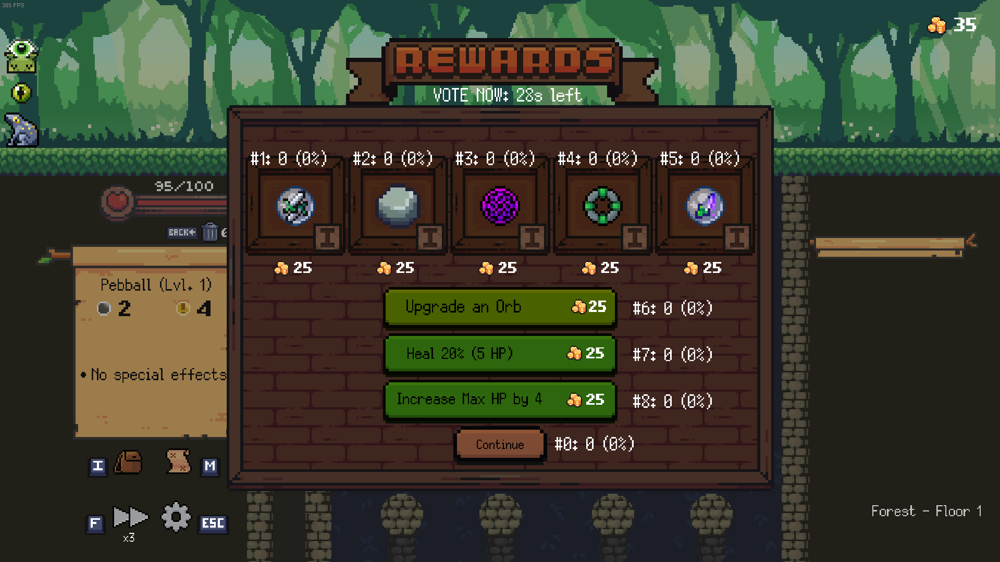

# Peg The Streamer

Let Twitch chat shape your build by letting them vote for relic and orb rewards.

Inspired by mod Slay the Streamer for the game Slay the Spire. 
Dedicated to Twitch streamer and YouTuber [FrostPrime_](https://www.twitch.tv/frostprime_) who frequently features Slay the Streamer and other fun content on his streams.

## Features

- Voting for starting, chest, elite and boss relics

- To give yourself a boost against chat, choose your starting deck from a random selection of orbs

- Enemies get assigned nicknames, which are pulled directly from your chat, allowing for funny interactions

- Post-battle rewards: orbs, upgrades, heal and max hp increase with toad relic

- Chat messages to let your chat know when the vote starts and ends without stream delay

- Extension to in-game options menu, allowing for configuration of the mod inside the game, without restarting.

## Installation guide

1. Have Peglin and Thunderstore installed
2. Download the mod using Thunderstore
3. Inside the game's options menu fill out login and OAuth fields
- Twitch login: you can get it from your channel link, for example mine is https://www.twitch.tv/rwrazor, so login would be rwrazor

- Twitch OAuth: to get your token follow [this link](https://id.twitch.tv/oauth2/authorize?response_type=token&client_id=q8rpt8d3r1jgim4g5mtmijn3bb15dw&redirect_uri=https://twitchapps.com/tmi/&scope=chat:read+chat:edit). Once you login into your twitch account it should ask for permission to read and write chat messages. Once you agree you should see a text field, copy and paste its full contents to corresponding in-game field.

Be careful not to show this token on stream. You can revoke this token in twitch settings (Settings->Connections->Other connections->PegTheStreamer->Disconnect)

4. Configure other options to your liking. Don't forget to save settings.
5. Ask your chat to be nice and to not bully you too much
6. Enjoy

See https://mods.pegl.in/ for links to the Discord and more.
